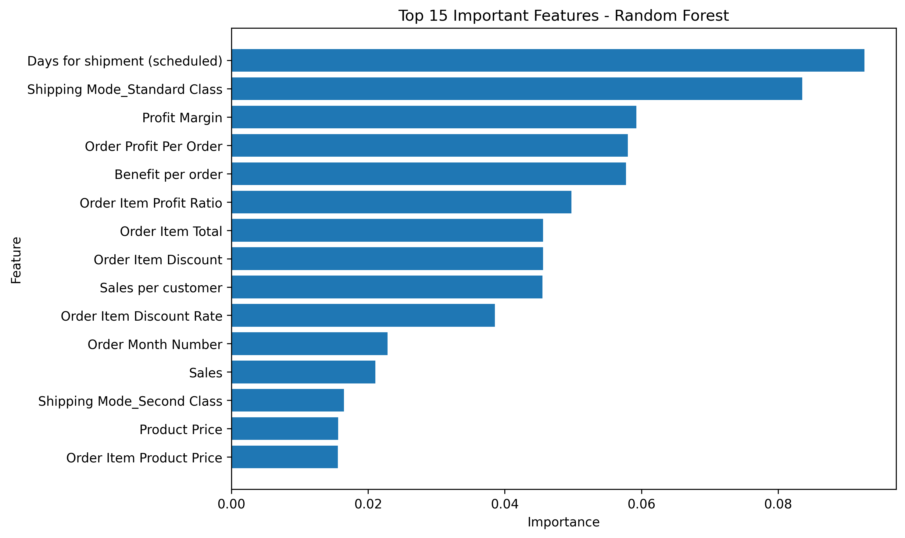
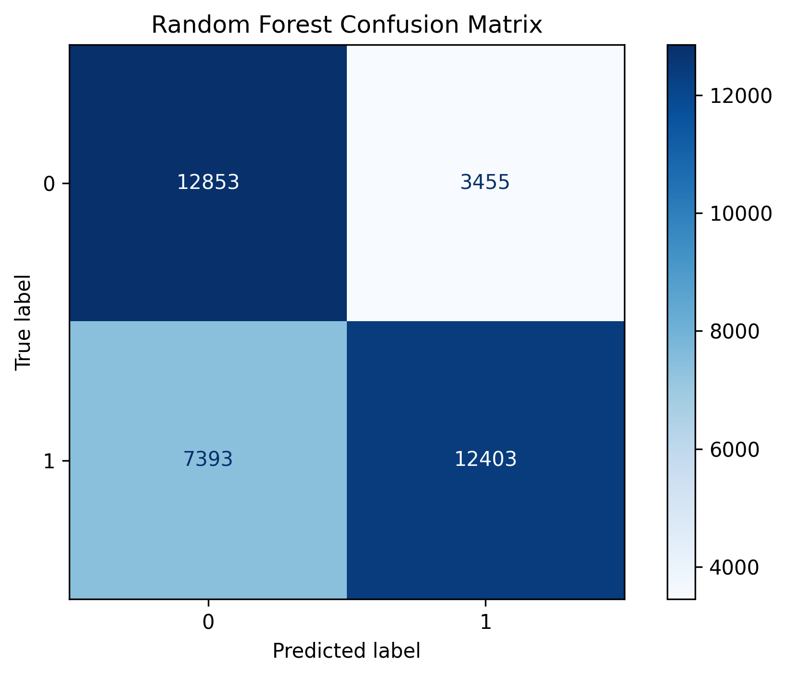
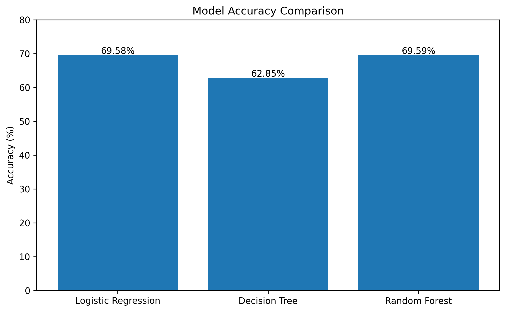

#  Supply Chain Late Delivery Prediction using Machine Learning


---
An end-to-end Machine Learning project that predicts the probability of late deliveries using historical supply chain data.

##  Project Overview

Late deliveries are a major challenge in supply chain management, affecting customer satisfaction and operational efficiency.

This project uses Machine Learning techniques to predict whether an order is likely to be delivered late based on order, customer, shipping, and product information.

The project includes:

- Data Cleaning
- Exploratory Data Analysis (EDA)
- Feature Engineering
- Model Training
- Model Evaluation
- Feature Importance Analysis


##  Problem Statement

Late deliveries in supply chain operations can lead to customer dissatisfaction, increased operational costs, and inefficient logistics planning.

The objective of this project is to develop a Machine Learning model that predicts whether an order is likely to be delivered late using historical supply chain data. Such predictions can help businesses take proactive measures to reduce delays and improve overall supply chain performance.

##  Dataset Information

- **Dataset:** DataCo Supply Chain Dataset
- **Source:** DataCo Global Supply Chain Dataset
- **Records:** ~180,000 orders
- **Features:** Customer, Product, Order, Shipping, Sales, Geography
- **Target Variable:** `Late_delivery_risk`

The dataset contains historical order information that enables the prediction of delivery delays before shipment.

##  Project Workflow

```text
Raw Dataset
      │
      ▼
Data Cleaning
      │
      ▼
Exploratory Data Analysis
      │
      ▼
Feature Engineering
      │
      ▼
Machine Learning Models
      │
      ▼
Model Evaluation
      │
      ▼
Late Delivery Prediction
```

##  Exploratory Data Analysis

The dataset was analysed to understand its structure, identify missing values, detect outliers, and uncover relationships between variables.

Key activities included:

- Handling missing values
- Exploring feature distributions
- Correlation analysis
- Identifying important variables
- Understanding delivery risk patterns

##  Feature Engineering

Several preprocessing and feature engineering techniques were applied to improve model performance.

These included:

- Removing irrelevant features
- Eliminating data leakage columns
- Encoding categorical variables using One-Hot Encoding
- Handling missing values
- Feature selection
- Data scaling (for Logistic Regression)

## 🤖 Machine Learning Models

The following classification models were trained and evaluated:

| Model | Accuracy | ROC-AUC |
|-------|---------:|---------:|
| Logistic Regression | 69.58% | 0.7413 |
| Decision Tree | 62.85% | 0.6244 |
| Random Forest | **69.59%** | **0.7574** |

The Random Forest model achieved the highest ROC-AUC score and was selected as the final model.

##  Results

After comparing multiple machine learning algorithms, Random Forest delivered the best overall performance for predicting late deliveries.

### Best Model Performance

- **Model:** Random Forest Classifier
- **Accuracy:** 69.59%
- **ROC-AUC Score:** 0.7574

The model successfully identifies delivery delay risks and can assist businesses in making proactive logistics decisions.

### Correlation Heatmap

The following heatmap illustrates the correlation between numerical features in the dataset.

<p align="center">
  
</p>

### Feature Importance

The Random Forest model identifies the following features as the most influential in predicting late deliveries.

<p align="center">
  
</p>

### Confusion Matrix

The confusion matrix shows the prediction performance of the final Random Forest model.

<p align="center">
  
</p>

### Model Comparison

Performance comparison of the machine learning models used in this project.

<p align="center">
  
</p>

##  Installation

Clone the repository:

```bash
git clone https://github.com/Dipesh-Kumar1/Supply-Chain-Late-Delivery-Prediction.git
```

Move into the project directory:

```bash
cd Supply-Chain-Late-Delivery-Prediction
```

Install dependencies:

```bash
pip install -r requirements.txt
```
##  How to Run

1. Clone this repository.
2. Install the required libraries.
3. Open the notebooks in Jupyter Notebook or Google Colab.
4. Run the notebooks sequentially:

- 01_Project_Understanding.ipynb
- 02_Exploratory_Data_Analysis.ipynb
- 03_Feature_Engineering.ipynb
- 04_Machine_Learning.ipynb
